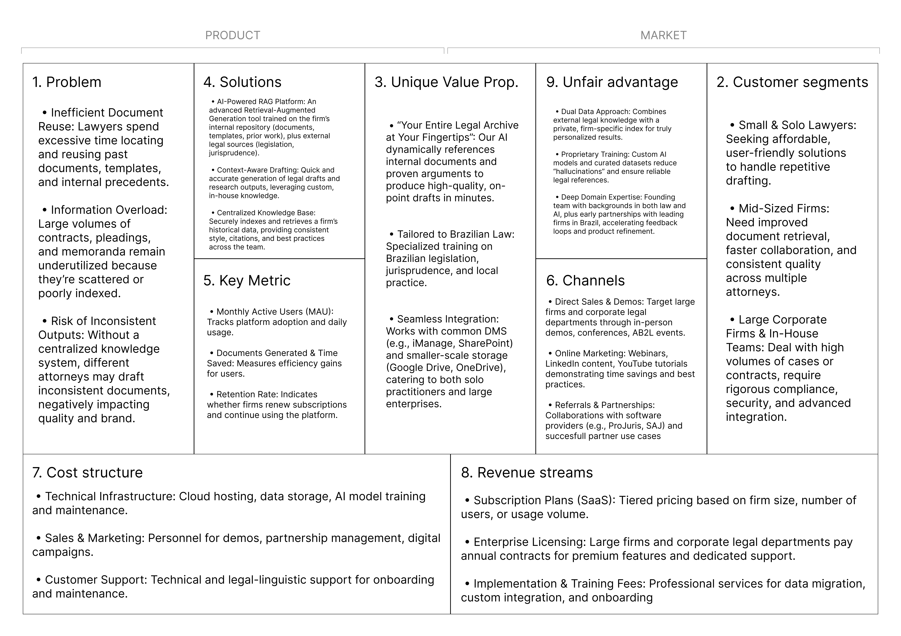

# Lean Canvas

### Problem
- **Inefficient Document Reuse**: Lawyers spend excessive time locating and reusing past documents, templates, and internal precedents.
- **Information Overload**: Large volumes of contracts, pleadings, and memoranda remain underutilized because they're scattered or poorly indexed.
- **Risk of Inconsistent Outputs**: Without a centralized knowledge system, different attorneys may draft inconsistent documents, negatively impacting quality and brand.

### Solutions
- **AI-Powered RAG Platform**: An advanced Retrieval-Augmented Generation tool trained on the firm's internal repository (documents, templates, prior work), plus external legal sources (legislation, jurisprudence).
- **Context-Aware Drafting**: Quick and accurate generation of legal drafts and research outputs, leveraging custom, in-house knowledge.
- **Centralized Knowledge Base**: Securely indexes and retrieves a firm's historical data, providing consistent style, citations, and best practices across the team.

### Unique Value Proposition
- **"Your Entire Legal Archive at Your Fingertips"**: Our AI dynamically references internal documents and proven arguments to produce high-quality, on-point drafts in minutes.
- **Tailored to Brazilian Law**: Specialized training on Brazilian legislation, jurisprudence, and local practice.
- **Seamless Integration**: Works with common DMS (e.g., iManage, SharePoint) and smaller-scale storage (Google Drive, OneDrive), catering to both solo practitioners and large enterprises.

### Key Metrics
- **Monthly Active Users (MAU)**: Tracks platform adoption and daily usage.
- **Documents Generated & Time Saved**: Measures efficiency gains for users.
- **Retention Rate**: Indicates whether firms renew subscriptions and continue using the platform.

### Customer Segments
- **Small & Solo Lawyers**: Seeking affordable, user-friendly solutions to handle repetitive drafting.
- **Mid-Sized Firms**: Need improved document retrieval, faster collaboration, and consistent quality across multiple attorneys.
- **Large Corporate Firms & In-House Teams**: Deal with high volumes of cases or contracts, require rigorous compliance, security, and advanced integration.

### Unfair Advantage
- **Dual Data Approach**: Combines external legal knowledge with a private, firm-specific index for truly personalized results.
- **Proprietary Training System**: AI models and curated datasets reduce "hallucinations" and ensure reliable legal references.
- **Deep Domain Expertise**: Founding team with backgrounds in both law and AI, plus early partnerships with leading firms in Brazil, accelerating feedback loops and product refinement.

### Channels
- **Direct Sales & Demos**: Target large firms and corporate legal departments through in-person demos, conferences, AB2L events.
- **Online Marketing**: Webinars, LinkedIn content, YouTube tutorials demonstrating time savings and best practices.
- **Referrals & Partnerships**: Collaborations with software providers (e.g., ProJuris, SAJ) and successful partner use cases.

### Cost Structure
- **Technical Infrastructure**: Cloud hosting, data storage, AI model training and maintenance.
- **Sales & Marketing**: Personnel for demos, partnership management, digital campaigns.
- **Customer Support**: Technical and legal-linguistic support for onboarding and maintenance.

### Revenue Streams
- **Subscription Plans (SaaS)**: Tiered pricing based on firm size, number of users, or usage volume.
- **Enterprise Licensing**: Large firms and corporate legal departments pay annual contracts for premium features and dedicated support.
- **Implementation & Training Fees**: Professional services for data migration, custom integration, and onboarding.
