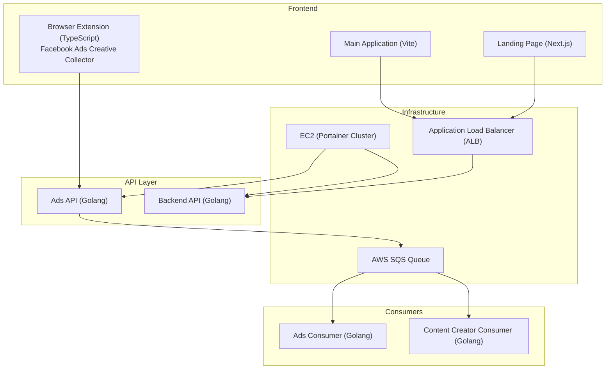

# 🏗️ Solution Architecture – Foundation Phase

## Overview

The Foundation phase of Magic Mango establishes a robust, scalable, and modular architecture. The system leverages modern cloud-native patterns, containerization, and asynchronous processing to ensure reliability and extensibility from the start.

## Architecture Diagram

## Component Breakdown

### 1. Frontend Layer
- **Landing Page (Next.js):**  Serves static content and marketing information.
- **Main Application (Vite):**  Provides the user interface for platform users.
- **Browser Extension (TypeScript):**  Allows users to collect creatives directly from Facebook Ads and send them to the Ads API.

### 2. API Layer
- **Ads API (Golang):**  Receives creatives from the browser extension, processes them, and pushes messages to the SQS queue.
- **Backend API (Golang):**  Handles requests from the landing page and main application, managing business logic and data access.

### 3. Infrastructure Layer
- **Application Load Balancer (ALB):**  Routes traffic from the landing page and main application to the appropriate backend services.
- **AWS EC2 (Portainer Cluster):**  Hosts all backend services and APIs as containers, managed as a cluster for scalability and resilience.
- **AWS SQS:**  Decouples the ingestion of creatives from their processing, enabling asynchronous and scalable workflows.

### 4. Consumer Layer
- **Ads Consumer (Golang):**  Processes messages from the SQS queue related to ad creatives.
- **Content Creator Consumer (Golang):**  Processes messages from the SQS queue related to content creation tasks.

## Data Flow

1. **Creative Collection:**  The browser extension collects creatives from Facebook Ads and sends them to the Ads API.
2. **API Processing:**  The Ads API validates and processes the creative, then enqueues a message in SQS.
3. **Frontend Interactions:**  Users interact with the landing page and main application, which communicate with the Backend API.
4. **Asynchronous Processing:**  Ads Consumer and Content Creator Consumer services pull messages from SQS and process them independently.
5. **Scalability & Reliability:**  The use of SQS and containerized services ensures the system can scale horizontally and recover from failures.

## Key Foundation Principles

- **Modularity:** Each component is independently deployable and replaceable.
- **Scalability:** SQS and container orchestration allow for horizontal scaling.
- **Resilience:** Decoupled processing and managed infrastructure ensure high availability.
- **Extensibility:** The architecture is ready for future integrations (e.g., TikTok, advanced AI modules). 